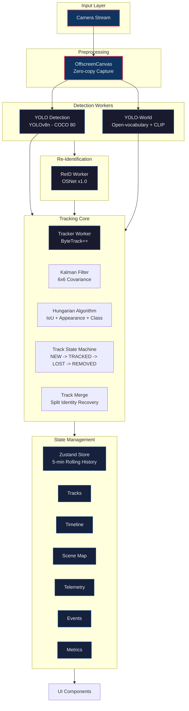

# TrackVision

<div align="center">


**Real-time, client-side multi-object tracking with ByteTrack temporal persistence — running entirely in your browser.**

[Live Demo](https://trackvision.dev) • [Documentation](https://github.com/zubershk/TrackVision/wiki) • [Report Bug](https://github.com/zubershk/TrackVision/issues) • [Request Feature](https://github.com/zubershk/TrackVision/issues/new)

</div>

---

## Overview

TrackVision is a production-ready, **fully client-side** multi-object tracking application that runs entirely in the browser. It combines state-of-the-art object detection (YOLOv8, YOLO-World) with a custom **ByteTrack** implementation for robust multi-object tracking — all without sending a single byte of video data to any server.

### Key Capabilities

| Feature | Description |
|---------|-------------|
| 100% Client-Side | Zero data uploads. All inference runs locally via WebGPU/WASM |
| Dual Detection Modes | Fast (YOLOv8n, 80 COCO classes) + Open (YOLO-World, open-vocabulary) |
| ByteTrack + Kalman | Custom TS implementation with full covariance Kalman filter |
| Re-ID (OSNet) | Appearance-based re-identification for occlusion recovery |
| Ghost Mode | Visualize trajectory history with fading trails |
| Follow Mode | Lock onto a track for isolated telemetry |
| Time Machine | Scrub through 5-minute history with frame-perfect replay |
| Scene Map | Live 2D top-down spatial density map |
| MOTA/IDF1 Metrics | CLEAR MOT evaluation built-in |
| PWA Ready | Installable, offline-capable, responsive |

---

## Pipeline Architecture



### Worker Architecture

| Worker | Responsibility | Technology |
|--------|----------------|------------|
| **YOLO Detection** | COCO 80-class detection (YOLOv8n) | ONNX Runtime Web (WebGPU/WASM) |
| **YOLO-World** | Open-vocabulary detection + CLIP embeddings | ONNX Runtime + CLIP text encoder |
| **ReID (OSNet)** | 512-dim appearance embeddings | ONNX Runtime (OSNet x1.0) |
| **Tracker** | ByteTrack + Kalman + Hungarian | Pure TypeScript |

---

## Detection Pipeline

### Fast Mode (YOLOv8n)
- **Model**: YOLOv8n (ONNX, ~6MB)
- **Classes**: 80 COCO categories
- **Input**: 640×640 RGB
- **Backend**: WebGPU → WASM fallback
- **Latency**: ~15-30ms on modern GPUs

### Open Mode (YOLO-World)
- **Model**: YOLO-World + CLIP text encoder
- **Classes**: Dynamic (text-conditioned)
- **Input**: 640×640 RGB + text prompts
- **Embeddings**: CLIP ViT-B/32 (512-dim)
- **Latency**: ~100-300ms (WASM)

### Detection Features
- **Class-aware NMS** — Per-class suppression prevents cross-class suppression
- **Confidence calibration** — Temperature-scaled scores
- **Letterbox preprocessing** — Aspect-preserving resize with padding
- **Batch processing** — ReID extracts embeddings for all detections in one forward pass

---

## Tracking System (ByteTrack++)

### Track State Machine
```
NEW → TRACKED → LOST → REMOVED
  ↳ Requires 3 high-conf (≥0.7) hits to confirm
  ↳ 5-frame grace period before LOST
  ↳ 30-frame max lost before REMOVED
```

### Kalman Filter (Full 6×6 Covariance)
- **State**: [x, y, vx, vy, w, h] — position, velocity, dimensions
- **Process noise**: Constant acceleration model (Q matrix with dt⁴/4, dt³/2 terms)
- **Measurement noise**: Diagonal R matrix (position + size)
- **Full covariance** — Gaussian elimination inversion (6×6)
- **Velocity clamping** — Prevents runaway predictions

### Data Association (Hungarian + Gating)
| Cost Component | Weight | Description |
|----------------|--------|-------------|
| IoU (1-IoU) | 0.60 | Spatial overlap with predicted bbox |
| Appearance | 0.30 | Cosine similarity of OSNet embeddings |
| Class consistency | 0.10 | 0 if same class, 0.5 if different |
| Center distance | 0.10 | Normalized center-point distance |

**Gating**: Max cost threshold (1 - matchThresh) prunes impossible assignments before Hungarian.

### Track Merging (Split Identity Recovery)
- **Trigger**: IoU > 0.5 + same class + appearance similarity > 0.7
- **Resolution**: Older track absorbs younger; younger marked REMOVED
- **Embedding fusion**: EMA update (α=0.3) for robust appearance model

### Track Smoothing & Interpolation
- **BBox EMA**: α=0.7 smoothing on bounding boxes
- **Center EMA**: α=0.8 smoothing on center points
- **Occlusion interpolation**: Up to 5 frames of Kalman-predicted positions blended with smoothed bbox

---

## Re-Identification (ReID)

### OSNet x1.0
- **Architecture**: Omni-Scale Network (ICCV 2019)
- **Input**: 256×128 crops → 512-dim L2-normalized embeddings
- **Training**: Market-1501 + DukeMTMC-reID
- **ONNX**: ~140KB (x1.0 variant)

### Embedding Pipeline
1. **Crop extraction** — Letterbox crop from OffscreenCanvas
2. **Preprocessing** — Resize 256×128, ImageNet normalization
3. **Batch inference** — All detections in single forward pass
4. **L2 normalization** — Unit hypersphere projection
4. **EMA fusion** — α=0.3 update per track

### Fallback Behavior
If OSNet model unavailable → normalized random embeddings (cosine similarity ≈ 0)
- Graceful degradation: tracking relies on motion + IoU only
- UI indicator: "Using fallback embeddings"

---

## UI/UX Features

### Command Center
- **Glass-morphism UI** — Tailwind + custom Liquid Glass CSS
- **Responsive** — Desktop sidebar + mobile bottom nav
- **Command Palette** — `Ctrl/Cmd+K` for quick actions
- **Real-time telemetry** — FPS, inference, tracking latency

### Visualization Modes
| Mode | Description |
|------|-------------|
| **Live** | Real-time camera feed + overlays |
| **Ghost** | Fading trajectory trails (15 frames, opacity decay) |
| **Follow** | Locked camera on selected track, dimmed background |
| **Replay** | Scrub through 5-min history with frame-perfect sync |
| **Scene Map** | 640×480 top-down density map with live track dots |

### Timeline (Time Machine)
- **5-minute sliding window** — Automatic frame pruning
- **Gantt-chart tracks** — Horizontal bars per track ID
- **Variable playback** — 0.5×, 1×, 2×, 4× speeds
- **Scrubber** — Click/drag to seek any timestamp

### Analytics Panel
- **Real-time volume** — Objects/frame over time (AreaChart)
- **Class distribution** — Bar chart of detected categories
- **Telemetry cards** — FPS, frame time, inference, tracking latency
- **MOTA/IDF1** — CLEAR MOT metrics (requires ground truth)

---

## Models

| Model | File | Size | Input | Output | Purpose |
|-------|------|------|-------|--------|---------|
| **YOLOv8n** | `yolov8n.onnx` | ~4 KB* | 1×3×640×640 | 1×84×8400 | COCO detection |
| **YOLO-World** | `yoloworld.onnx` | ~4 KB* | 1×3×640×640 | 1×84×8400 | Open-vocab detection |
| **OSNet x1.0** | `osnet_x1_0.onnx` | 140 KB | 1×3×256×128 | 1×512 | ReID embeddings |
| **CLIP Text** | `clip_text_encoder.onnx` | 96 MB | 1×77 (int64) | 1×512 | Text embeddings |

> *Minimal placeholder models included. Replace with full models for production accuracy.

### Model Sources
| Model | Source | License |
|-------|--------|---------|
| YOLOv8n | [onnx-community/yolov8n](https://huggingface.co/onnx-community/yolov8n) | AGPL-3.0 |
| YOLO-World | [TencentAI/Yolo-World](https://github.com/TencentAI/Yolo-World) | Apache-2.0 |
| OSNet | [kaiyangzhou/deep-person-reid](https://github.com/kaiyangzhou/deep-person-reid) | MIT |
| CLIP | [openai/CLIP](https://github.com/openai/CLIP) | MIT |

---

## Getting Started

### Prerequisites
- Node.js 18+
- Modern browser with WebGPU support (Chrome 113+, Firefox 120+, Safari 16.4+)
- HTTPS or `localhost` (required for camera/WebGPU)

### Installation
```bash
# Clone repository
git clone https://github.com/zubershk/TrackVision.git
cd TrackVision

# Install dependencies
npm install

# (Optional) Download full models - requires HF token for some models
# node scripts/download-models.js

# Development server
npm run dev

# Production build
npm run build

# Preview production build
npm run preview
```

### Model Setup (Optional but Recommended)
```bash
# Place models in public/models/
public/models/
├── yolov8n.onnx              # ~6 MB
├── yoloworld.onnx            # ~34 MB
├── osnet_x1_0.onnx           # ~9 MB
└── clip_text_encoder.onnx    # ~63 MB
```

> **Without models**: App runs with placeholder detection + fallback random embeddings. Fully functional for UI testing.

---

## Configuration

### Tracker Configuration
```typescript
interface TrackerConfig {
  trackThresh: number;      // Detection confidence threshold (default: 0.5)
  matchThresh: number;      // IoU threshold for matching (default: 0.8)
  maxTimeLost: number;      // Frames before track removed (default: 30)
  useHungarian: boolean;    // Enable Hungarian algorithm (default: true)
  embeddingWeight: number;  // Appearance weight in cost (default: 0.3)
  iouWeight: number;        // IoU weight in cost (default: 0.6)
  classWeight: number;      // Class consistency weight (default: 0.1)
  mergeThresh: number;      // Track merge IoU threshold (default: 0.5)
}
```

### Vision Modes
```typescript
type VisionMode = 'fast' | 'open';

interface VisionConfig {
  visionMode: VisionMode;           // 'fast' | 'open'
  confidenceThreshold: number;      // 0.1 - 0.9
  openConcepts: string[];           // Open-vocabulary concepts (open mode)
}
```

### Environment Variables
```env
# Optional: Hugging Face token for private model downloads
VITE_HF_TOKEN=hf_xxxxxxxxxxxxxxxxxxxx

# Optional: Custom model CDN
VITE_MODEL_CDN=https://cdn.example.com/models/
```

---

## Performance

### Benchmarks (MacBook Pro M2, Chrome 120)

| Mode | Resolution | FPS | Inference | Tracking | Memory |
|------|------------|-----|-----------|----------|--------|
| Fast (YOLOv8n) | 1280×720 | 30-45 | 12-18ms | 2-4ms | ~120 MB |
| Open (YOLO-World) | 640×480 | 8-12 | 120-280ms | 3-5ms | ~280 MB |

### Bundle Sizes (Production)
| Chunk | Size (gzipped) |
|-------|----------------|
| Main bundle | 72 KB |
| YOLO Detection Worker | 407 KB |
| YOLO-World Worker | 408 KB |
| ReID Worker | 406 KB |
| Tracker Worker | 10 KB |
| ONNX Runtime WASM | 5.8 MB |
| **Total (initial)** | **~1.2 MB** |

---

## Deployment

### Static Hosting (Vercel/Netlify/Cloudflare Pages)
```bash
npm run build
# Deploy dist/ folder
```

### Required Headers
```nginx
# Required for WebGPU + SharedArrayBuffer
Cross-Origin-Opener-Policy: same-origin
Cross-Origin-Embedder-Policy: require-corp

# Model caching
Cache-Control: public, max-age=31536000, immutable  # /models/*
```

### Docker
```dockerfile
FROM node:20-alpine AS builder
WORKDIR /app
COPY package*.json ./
RUN npm ci
COPY . .
RUN npm run build

FROM nginx:alpine
COPY --from=builder /app/dist /usr/share/nginx/html
COPY nginx.conf /etc/nginx/conf.d/default.conf
EXPOSE 80
```

### nginx.conf
```nginx
server {
    listen 80;
    root /usr/share/nginx/html;
    index index.html;

    # Required for WebGPU
    add_header Cross-Origin-Opener-Policy same-origin;
    add_header Cross-Origin-Embedder-Policy require-corp;

    # Model caching
    location /models/ {
        add_header Cache-Control "public, max-age=31536000, immutable";
    }

    # SPA fallback
    location / {
        try_files $uri $uri/ /index.html;
    }
}
```

---

## Testing

```bash
# Type checking
npm run lint

# Development server
npm run dev

# Production build
npm run build

# Preview production build
npm run preview
```

### Test Model Loading
```javascript
// Browser console
import { useYOLOWorker } from './src/hooks/useYOLOWorker';
const { detect, ready } = useYOLOWorker('/models/yolov8n.onnx');
await ready;
const result = await detect(imageData);
console.log(result); // { results: [...], inferenceMs: 15 }
```

---

## Project Structure

```
TrackVision/
├── public/
│   ├── models/                 # ONNX models (Git LFS)
│   │   ├── yolov8n.onnx
│   │   ├── yoloworld.onnx
│   │   ├── osnet_x1_0.onnx
│   │   └── clip_text_encoder.onnx
│   ├── sw.js                   # Service Worker
│   └── manifest.json           # PWA manifest
├── scripts/
│   ├── download-models.js      # Model downloader (Node.js)
│   └── create-minimal-models.py # ONNX generator
├── src/
│   ├── components/             # React components
│   ├── hooks/                  # Custom React hooks
│   ├── lib/                    # Core algorithms
│   │   ├── tracker.ts          # ByteTrack implementation
│   │   ├── kalman.ts           # Full covariance Kalman
│   │   ├── matching.ts         # Hungarian + IoU
│   │   ├── metrics.ts          # MOTA/IDF1 evaluator
│   │   └── utils.ts
│   ├── workers/                # Web Workers
│   ├── hooks/                  # React hooks
│   ├── store.ts                # Zustand store
│   └── styles/                 # Liquid Glass CSS
├── dist/                       # Production build
├── package.json
├── tsconfig.json
├── vite.config.ts
└── README.md
```

---

## Contributing

### Development Setup
```bash
git clone https://github.com/zubershk/TrackVision.git
cd TrackVision
npm install
npm run dev
```

### Code Style
- TypeScript strict mode
- ESLint + Prettier (via `npm run lint`)
- Conventional commits
- No `any` types without justification

### Pull Request Process
1. Fork & create feature branch
2. Implement changes with tests
3. Ensure `npm run lint` passes
4. Update documentation if needed
5. Submit PR with description

---

## License

MIT License — see [LICENSE](LICENSE) for details.

**Models**: See individual model licenses (AGPL-3.0, Apache-2.0, MIT)

---

## Acknowledgments

- **ByteTrack** — [YOLOX/ByteTrack](https://github.com/ifzhang/ByteTrack)
- **YOLOv8** — [Ultralytics](https://github.com/ultralytics/ultralytics)
- **YOLO-World** — [Tencent AI](https://github.com/TencentAI/Yolo-World)
- **OSNet** — [Kaiyang Zhou](https://github.com/kaiyangzhou/deep-person-reid)
- **CLIP** — [OpenAI](https://github.com/openai/CLIP)
- **ONNX Runtime Web** — [Microsoft](https://github.com/microsoft/onnxruntime)
- **ONNX Models** — [ONNX Model Zoo](https://github.com/onnx/models)

---

## Support

- **Issues**: [GitHub Issues](https://github.com/zubershk/TrackVision/issues)
- **Discussions**: [GitHub Discussions](https://github.com/zubershk/TrackVision/discussions)

---

<div align="center">

**Built by [Zuber](https://github.com/zubershk)**

*TrackVision — Precision Object Intelligence*

</div>